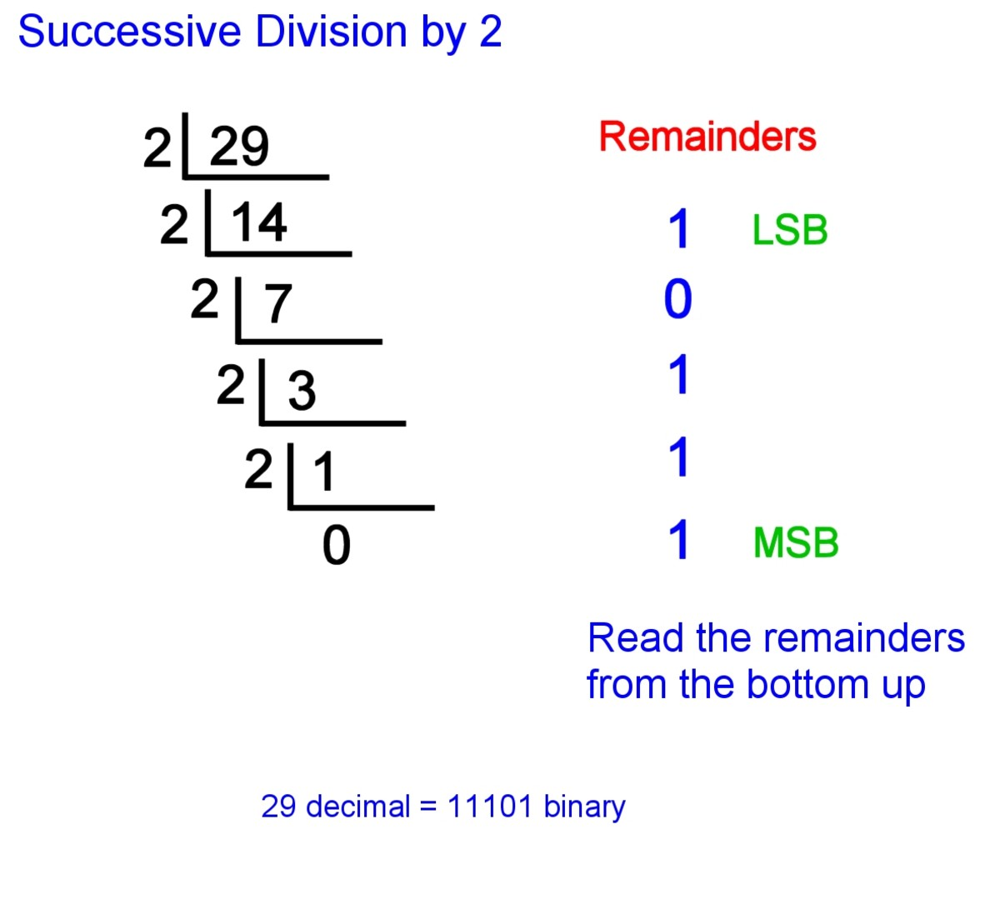
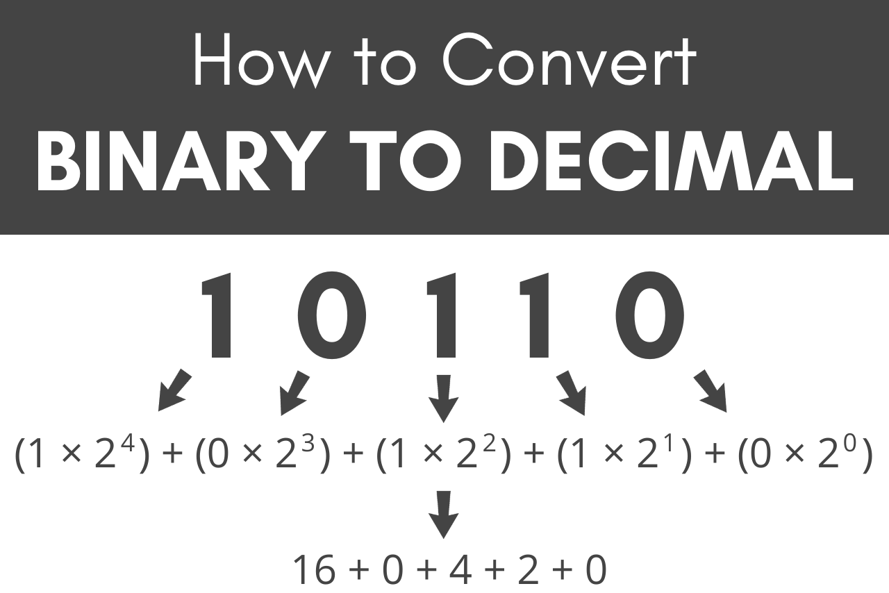

# Binary Number System and Bitwise Operators

## Binary Numbers System

Binary number system has bas Base `2` whereas our normal decimal number system has base `10`. i.e. Binary number system consistes of only 2 numbers `0` and `1` and in decimal number system there are `10` numbers (0 to 9).

### Decimal to binary

1. start dividing number with `2` write remainders.

2. Divide till we reach 0.

3. Atlast write the remainders in reverse form and that will be our binary number.



### Binary to Decimal

We can convert a binary number to decimal by multiplying is first digit from right with `2 to the power 0` and second digit from right with `2 to the power 1` and so on. Atlast add all the results.

Here you can see the example:



## Bitwise Operators

- Bitwise `AND` --> `&`
- Bitwise `OR` --> `|`
- Bitwise `NOT` --> `~`
- Bitwise `Exclusive OR` --> `^`
- Bitwise `Left Shift` --> `<<`
- Bitwise `Right Shift` --> `>>`

**Bitwise AND operator:** Returns 1 if both the bits are 1 else 0.

**Bitwise OR operator:** Returns 1 if either of the bits are 1 else 0.

**Bitwise NOT operator:** Returns 1's complement of given number.

**Bitwise Exclusive OR (xor) operator:** Returns 1 if one bit is 1 and other is 0  else return 0.

**Bitwise right shift:** Shifts the bits of the number to the right and fills 0 on voids left.

**Bitwise left shift:** Shifts the bits of the number to the left and fills 0 on voids right as a result.

Note: In python `bin(number)` is used to convert number to it's binary form.

```python

# Bitwise and
>>> a = 2 #  0010
>>> b = 4 #  0100
>>> a & b #  0000
0

# Bitwise or
>>> a = 2 #  0010
>>> b = 4 #  0100
>>> a | b #  0110
6

# Bitwise xor
>>> a = 6 #  0110
>>> b = 4 #  0100
>>> a ^ b #  0010
2

# Bitwise Not
>>> ~10 # 1010
-11
# how we get -11?
# 1010
# +001 -> demial 1
# 1011 -> decimal 11
# add a negative sign.

# Bitwise Left Shift.
>>> a = 4 # 100
>>> a << 1 # 1000
8 

# Bitwise Right Shift.
>>> a = 4 # 100
>>> a >> 1 # 010
2
 
```
