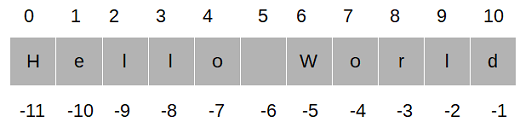

# Strings

**Strings:** in python It is defined as sequence of characters or a single character. In python we enclose strings in single or double quote.

We can also write multiline strings using triple quotes.

```python

# single line strings
>>> st1 = "Hello world"
>>> st2 = 'Welcome'
# we can use sigle or double quote , it's all upto you as there is no difference.

# Multiline strings.
>>> st3 = """ this is a multiline string
as you can see."""

```

## Index in string and Slicing

In strings, Index and Slicing works the same way as in lists.

here n is size of string.

Each character in string has a unique index. index start from 0 and ends at n-1.
Python  string also have negative indexing, -1 fro right most element and -n for left most element.



## Operations on String

We can use `+`, `*`, `in` and `is` operator with strings.

```python

>>> st = "hello"
>>> ts = "world"

>>> st+ts
'helloworld'

>>> st*2
'hellohello'

>>> "he" in st
True

>>> st is ts
False

```

## Some in-built Function for preforming operation on strings

- `upper()` : return a new string with all uppercase letters

- `isupper()` : checks whether given string is in uppercase of not. i.e. all letters are in uppercase or not.

- `upper()` : return a new string with all lowercase letters.

- `isupper()` : checks whether given string is in lowercase or not.

- `split(separator)`:it breaks up a string at the specified separator and returns a list of strings.By default separator is `' '`.

- `separator.join(iterable)`: returns a string by joining all the elements of an iterable (list, string, tuple), separated by a string separator.

- `find()`: returns the index of first occurrence of the substring (if found). If not found, it returns -1.

**[Python Functions Documentation](https://docs.python.org/3/library/stdtypes.html#string-methods)**
