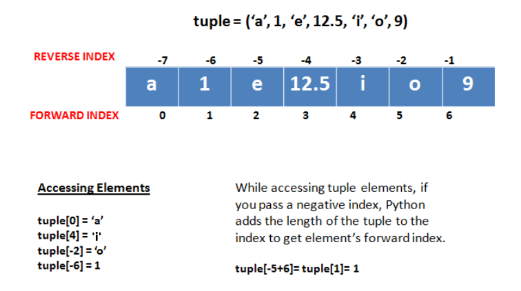

# Tuples

A tuple is a collection of python objects separated by commas.
The difference between list and tuple is that the tuple cannot be modified once created which means tuples are Immutable objects. Tuple use parenthesis instead of square brackets as used in lists.

```python

# Creating or Intializing tuple.
>>> tp = (1,2,3,4,5)
>>> print(tp)
(1,2,3,4,5)

# Converting a list into a tuple
>>> ls = ["Tarun", 1, 3, 5]
>>> t = tuple(ls)
>>> print(t)
("Tarun", 1, 3, 5)

```

## Index and Slicing in tuple

In tuple, Index and Slicing works the same way as in lists and string.

here `n` is size of tuple.

Each character in string has a unique index. index start from `0` and ends at `n-1`.
Python  string also have negative indexing, `-1` for right most element and `-n` for left most element.



## Operations on tuple

We can use `+`, `*`, `in` and `is` operator with tuple.

```python

>>> tp1 = (1,2,3,4,5)
>>> tp2 = ("Tarun", 1, 3, 5)
>>> tp3 = tp1 + tp2
>>> print(tp3)
(1,2,3,4,5,"Tarun",1,3,5)

>>> t = (1,2)*2
>>> print(t)
(1,2,1,2)

>>> t = (1,2)
>>> s = t*2
>>> t in s
True

>>> t is s
False

```

## Some in-built Function for preforming operation on Tuple

- `count` : Return number of occurrences of value.

- `index` : Return first index of value.Raises ValueError if the value is not present.
